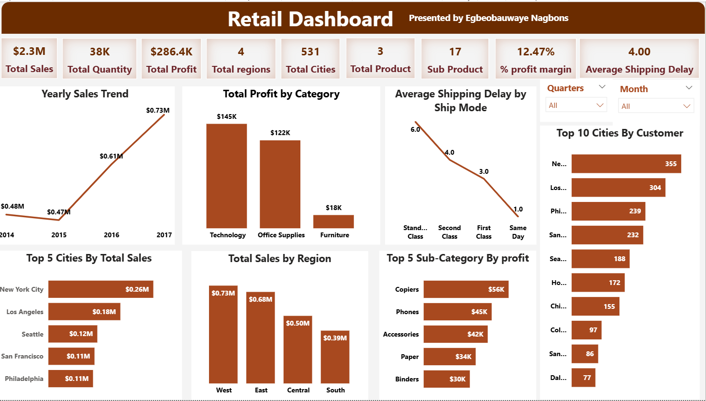
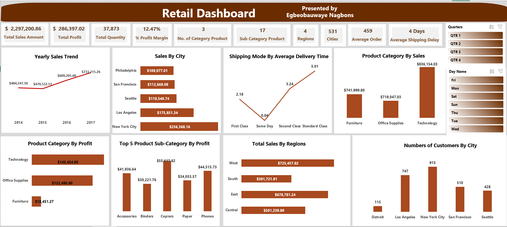

# Retail-Sales-Analytics-Dashboard-using-PowerBI-and-Excel
An interactive Power BI dashboard developed to analyze retail sales performance, profitability, customer distribution, and shipping efficiency across multiple regions and product categories. The dashboard provides business insights through KPI tracking, trend analysis, and interactive visualizations to support data-driven decision-making.

## Key Features
- Sales and profit performance analysis
- Yearly sales trend tracking
- Product category and sub-category profitability analysis
- Regional and city-level sales insights
- Shipping mode and delivery time analysis
- Customer distribution by city
- Interactive filters for quarters and weekdays

## KPIs Included
- Total Sales Amount: $2.29M
- Total Profit: $286.39K
- Total Quantity Sold: 37,873
- Profit Margin: 12.47%
- Average Orders: 459
- Average Shipping Delay: 4 Days

## Tools & Technologies
- Power BI
- Excel
- DAX
- Data Cleaning & Transformation
- Business Intelligence Reporting

## Business Impact
This dashboard helps businesses monitor sales growth, identify profitable product categories, optimize shipping performance, and understand regional customer behavior, enabling more effective strategic and operational decisions.
## Dashboard Built with PowerBI

## Dashboard Built with Excel

